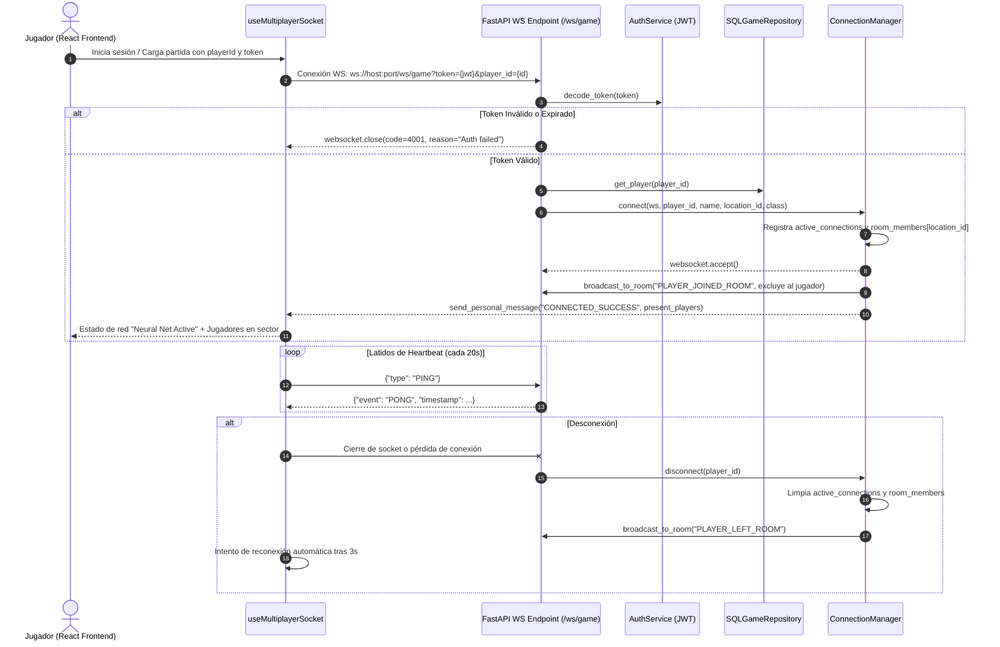

# Arquitectura y Plan de Implementación Multijugador (MUD / Realtime)

Este documento detalla la especificación técnica, arquitectura y desglose de tareas para transformar el juego en una experiencia multijugador en tiempo real.

---

## 1. Evaluación de Viabilidad y Estado Actual

- **Viabilidad Técnica**: Muy Alta (85% de la base ya desacoplada).
- **Modelo Actual**: Cliente-Servidor REST (FastAPI + React). La base de datos SQLite ya centraliza el estado del mundo, items en el suelo y enemigos por coordenadas.
- **Transición**: Evolución a arquitectura híbrida **REST + WebSockets** (MUD Moderno).

---

## 2. Componentes de la Arquitectura

### A. Gestor de Conexiones en Tiempo Real (`ConnectionManager`)
* **Ubicación**: `app/adapters/driving/websocket/connection_manager.py`
* **Responsabilidad**:
  - Mantener diccionario en memoria de conexiones activas: `active_connections[player_id] = WebSocket`.
  - Mapeo de jugadores por sala/coordenadas: `room_members[location_id] = Set[player_id]`.
  - Métodos de difusión (*broadcasting*):
    - `broadcast_to_room(location_id, data, exclude_player_id)`
    - `broadcast_global(data, exclude_player_id)`
    - `send_whisper(sender_id, target_name, text)`
    - `send_personal_message(player_id, message)`

### B. Ciclo de Inicialización y Conexión (Handshake & Lifecycle)

El proceso de inicialización y conexión del WebSocket se realiza de forma automática y segura siguiendo los siguientes pasos:



#### Parámetros de Inicialización:
- **URL**: `ws://<host>:<puerto>/ws/game`
- **Query Params**:
  - `token`: Token JWT obtenido tras el registro/login exitoso (`/api/v1/auth/login` o `/api/v1/start`).
  - `player_id`: ID único del jugador conectado.

#### Estados de Conexión en Frontend:
1. **Desconectado**: Sin enlace WebSocket activo (`Neural Net Offline`).
2. **Conectando / Autenticando**: Apertura de socket y validación del JWT en backend.
3. **Conectado y Sincronizado**: Recibe `CONNECTED_SUCCESS`, carga la lista de aventureros en la sala (`present_players`) y arranca el temporizador de *heartbeat* (PING cada 20s).
4. **Reconexión Automática**: En caso de interrupción de red, el hook reintenta la conexión tras 3 segundos.

### C. Protocolo de Mensajería WebSocket
Todos los mensajes se estructuran en formato JSON estandarizado:

```json
{
  "event": "ROOM_EVENT",
  "subtype": "PLAYER_ENTERED",
  "timestamp": 1726982400,
  "data": {
    "player_id": "p-123",
    "player_name": "Alden",
    "direction": "south",
    "message": "Alden ha llegado desde el norte."
  }
}
```

#### Tipos de Eventos Principales:
1. **Presencia y Movimiento**:
   - `PLAYER_JOINED_ROOM`: Se emite cuando un jugador entra a la casilla actual.
   - `PLAYER_LEFT_ROOM`: Se emite cuando un jugador sale de la casilla.
2. **Chat y Comunicación**:
   - `CHAT_SAY`: Mensaje local (solo visible en la misma casilla).
   - `CHAT_SHOUT`: Mensaje global (para todos los jugadores conectados).
   - `CHAT_WHISPER`: Mensaje privado entre dos jugadores.
3. **Mundo y Combate**:
   - `ROOM_LOOT_TAKEN`: Se emite cuando alguien recoge un ítem del suelo.
   - `ROOM_COMBAT_ACTION`: Se emite cuando un jugador golpea o usa una habilidad contra un enemigo en la sala.
   - `ENEMY_DEFEATED`: Se emite cuando el enemigo de la sala muere y deja caer botín.

---

## 3. Control de Concurrencia y Consistencia

Para evitar condiciones de carrera (por ejemplo, que dos jugadores intenten recoger la misma espada del suelo al mismo milisegundo):
- **Locks por Sala (Room-level Locks)**: Bloqueo asíncrono temporal en el backend para operaciones de inventario o combate en la misma `location_id`.
- **Transacciones Atómicas en Repositorio**: Si el ítem ya no se encuentra en `location.items` al momento de persistir, la acción retorna "El objeto ya no está aquí" de forma segura.

---

## 4. Desglose de Tareas por Fases

### Fase 1: Autenticación, Sesiones y Conexión WebSocket Base
- [x] **1.1. Sistema de Cuentas y Login**:
  - [x] Crear modelo de cuenta de usuario (`PlayerDB` con password_hash y salt).
  - [x] Endpoint `/api/v1/auth/register` y `/api/v1/auth/login`.
  - [x] Generación y validación de tokens de sesión JWT (`auth_service.py`).
- [x] **1.2. Servidor WebSocket en FastAPI**:
  - [x] Implementar `ConnectionManager` en `app/adapters/driving/websocket/connection_manager.py`.
  - [x] Crear endpoint `/ws/game` con validación de token JWT y player_id.
  - [x] Control de conexión, desconexión y latidos (*heartbeats / ping-pong* cada 20s).

### Fase 2: Presencia de Jugadores y Sistema de Chat
- [x] **2.1. Presencia Espacial**:
  - [x] Notificar a los ocupantes de una sala cuando un jugador entra o sale (`update_player_location`).
  - [x] Incluir lista de jugadores presentes en la respuesta de `Location` (`present_players` / `room_members`).
- [x] **2.2. Canales de Chat**:
  - [x] Comando `say <mensaje>` (chat local de sala / `CHAT_SAY`).
  - [x] Comando `shout <mensaje>` (chat global / `CHAT_SHOUT`).
  - [x] Comando `whisper <jugador> <mensaje>` (mensajería directa privada / `CHAT_WHISPER`).
- [x] **2.3. Frontend - Componente de Chat y Presencia**:
  - [x] Hook de React `useMultiplayerSocket` para reconexión automática y heartbeats.
  - [x] Panel flotante de Chat (`MultiplayerChatPanel.tsx`) con pestañas (Zona, Global, Susurro, Jugadores).
  - [x] Lista visual de "Aventureros en sector" en el panel de entidades (`EntityList.tsx`).

### Fase 3: Acciones Compartidas y Concurrencia
- [ ] **3.1. Sincronización de Botín (Loot)**:
  - [ ] Difusión inmediata de objetos tirados o recogidos del suelo en la sala.
  - [ ] Manejo de errores por recolección concurrente sin desincronización.
- [ ] **3.2. Sistema de Intercambio (Trading)**:
  - [ ] Comandos `trade offer <jugador>`, `trade accept`, `trade cancel`.
  - [ ] Modal interactivo de intercambio seguro de oro e ítems.

### Fase 4: Combate Cooperativo y Sistema de Grupos (Party)
- [ ] **4.1. Combate en Sala Compartida**:
  - [ ] Los enemigos en la sala reciben daño compartido de múltiples atacantes.
  - [ ] Registro de combate en tiempo real visible para todos los presentes en la casilla.
  - [ ] Distribución justa de experiencia (XP) y botín según contribución.
- [x] **4.2. Sistema de Grupos (Party)**:
  - [x] Comandos y eventos `party create`, `party invite <jugador>`, `party accept`, `party decline`, `party leave`, `party kick`.
  - [x] Chat dedicado de grupo (`CHAT_PARTY` / `/p`) sincronizado en tiempo real a través de cualquier punto o piso de mazmorra.
  - [x] Interfaz reactiva con visualización de estado de miembros, rol de líder, ubicación en tiempo real y directorio de jugadores online.

